# 가상머신 마이그레이션

목차
1. [가상머신 마이그레이션 소개](./vm_migration.md#1-가상머신-마이그레이션-소개)<br>
2. [VMware 프로바이더를 위한 사전 준비](./vm_migration.md#2-vmware-프로바이더를-위한-사전-준비)<br>
3. [VMware로부터 가상머신 마이그레이션](./vm_migration.md#3-vmware로부터-가상머신-마이그레이션)<br>
   3.1 [VMware 환경 리뷰](./vm_migration.md#31-vmware-환경-리뷰)<br>
   3.2 [마이그레이션 툴킷에 대한 VMware 공급자 생성](./vm_migration.md#32-마이그레이션-툴킷에-대한-vmware-공급자-생성)<br>
   3.3 [스토리지 및 네트워크 매핑 생성](./vm_migration.md#33-스토리지-및-네트워크-매핑-생성)<br>
   3.4 [마이그레이션 계획 생성](./vm_migration.md#34-마이그레이션-계획-생성)<br>
   3.5 [마이그레이션된 가상머신 리뷰 및 구성](./vm_migration.md#35-마이그레이션-가상머신-리뷰-및-구성)<br>
4. [요약](./vm_migration.md#4-요약)
<br>
<br>

## 1. 가상머신 마이그레이션 소개

이 실습에서는 MTV(Migration Toolkit for Virtualization)를 사용하여 VMware vSphere에서 오픈시프트로 가상머신을 가져옵니다. 마이그레이션 툴킷은 두 가지 가져오기 "모드"를 지원합니다.

* 콜드(cold) 마이그레이션은 마이그레이션을 시작하기 전에 소스 가상머신을 끕니다. 이것이 기본 마이그레이션 유형입니다.
* 웜(warm) 마이그레이션은 원본 가상머신이 계속 실행되는 동안 데이터를 복사합니다. 대량의 데이터가 마이그레이션되면 가상머신이 종료되고 최종 데이터가 대상에 복사됩니다. 그런 다음 새 가상머신을 시작할 수 있으므로 가상머신 호스팅 애플리케이션의 가동 중지 시간이 훨씬 단축됩니다.

마이그레이션 도구 키트는 이미 오퍼레이터를 사용하여 클러스터에 배포되었습니다. 오퍼레이터 설치 및 구성 방법에 대한 문서는 [여기](https://access.redhat.com/documentation/en-us/migration_toolkit_for_virtualization/)에서 찾을 수 있습니다.

가상화용 마이그레이션 툴킷을 구성하는 방법에 대해 자세히 알아보려면 여기에서 레드햇 가상화 관련 [문서](https://access.redhat.com/documentation/en-us/migration_toolkit_for_virtualization/2.4/html/installing_and_using_the_migration_toolkit_for_virtualization/prerequisites#rhv-prerequisites_mtv)를 참조하거나 VMware vSphere에 대하여 [여기](https://access.redhat.com/documentation/en-us/migration_toolkit_for_virtualization/2.4/html/installing_and_using_the_migration_toolkit_for_virtualization/prerequisites#vmware-prerequisites_mtv)에서 알아보십시오.
<br>
<br>

## 2. VMware 프로바이더를 위한 사전 준비

모든 마이그레이션에는 다음 필수 구성 요소가 적용됩니다.

* ISO/CD-ROM 디스크는 마운트 해제되어야 합니다.
* 각 NIC에는 하나의 IPv4 및/또는 하나의 IPv6 주소가 포함되어야 합니다.
* 가상머신 운영체제는 [오픈시프트 가상화에서 게스트 운영체제](https://access.redhat.com/articles/973163#ocpvirt)로 사용하기 위해 인증 및 지원되어야 합니다.
* 가상머신 이름에는 소문자(a\~z), 숫자(0\~9) 또는 하이픈(-)만 포함해야 하며 최대 253자까지 가능합니다. 첫 번째와 마지막 문자는 영숫자여야 합니다. 이름에는 대문자, 공백, 마침표(.) 또는 특수 문자가 포함될 수 없습니다.
* 가상머신 이름은 오픈시프트 가상화 환경의 기존 가상머신 이름과 중복되어서는 안 됩니다.

**Migration Toolkit for Virtualization**은 규칙을 준수하지 않는 가상머신에 자동으로 새 이름을 할당합니다. 이런 일이 발생하면 MTV는 마이그레이션이 원활하게 진행될 수 있도록 자동으로 새로운 가상머신 이름을 생성합니다.
<br>
<br>

## 3. VMware로부터 가상머신 마이그레이션

오픈시프트로 마이그레이션할 수 있도록 3계층 애플리케이션이 VMware에 배포되었습니다.

애플리케이션은 다음 4개의 가상머신으로 구성됩니다.

* 트래픽을 웹 서버로 리디렉션하는 단일 프록시 시스템 (1개의 가상머신)
* 데이터베이스에 연결되는 PHP 애플리케이션을 호스팅하는 IIS가 있는 두 개의 마이크로소프트 윈도우 서버 (2개의 가상머신)
* MariaDB 데이터베이스를 실행하는 하나의 리눅스 시스템 (1개의 가상머신)

이 애플리케이션은 이 [링크](http://webapp.vc.opentlc.com/)에서 액세스할 수 있습니다.

4개의 가상 머신 중 3개를 마이그레이션합니다. 오픈시프트는 SDN에 연결된 가상머신에 대한 네트워크 트래픽 및 로드 밸런싱을 기본적으로 처리하므로 프록시(로드 밸런서) 가상머신을 마이그레이션할 필요가 없습니다.

<br>

### 3.1 VMware 환경 리뷰

1. 제공 받은 vCenter Console 접속 정보를 확인하여 포털에 접속합니다.
   주소는 `vcsrsxx`으로 시작합니다.

   **VSPHERE CLIENT 시작**을 누릅니다.<br>
   </img> <br> 

   사용자 `vcenter_user` 및 비밀번호 `%vcenter_password%`로 로그인합니다.
   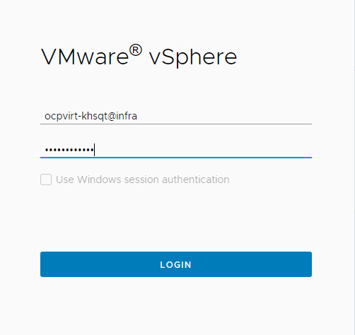</img> <br> 
<br>

3. **VM** 탭을 선택하여 가상머신 리스트를 확인합니다.

   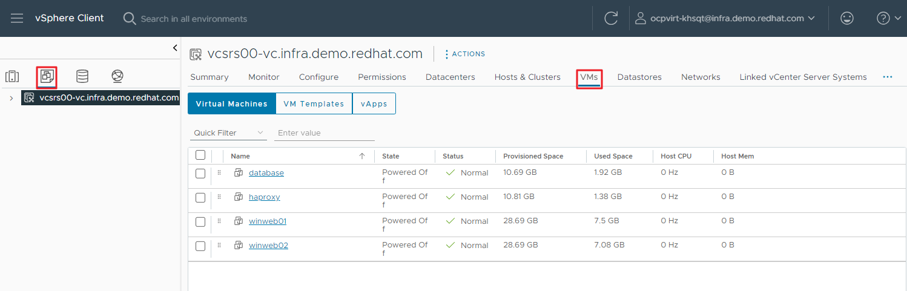</img> <br> 

> [!NOTE]
> 접미사가 `_running`인 가상머신이 활성화된 가상머신입니다. 마이그레이션을 중지해야 하는 경우 마이그레이션을 위해 가상머신의 복제본이 생성되었습니다. 해당 가상머신은 해당 접미사가 없는 가상머신입니다.
<br>

3. vCneter 화면에서 세그먼트를 검토하세요.

   </img> <br> 
<br>

4. vCenter 화면에서 스토리지를 검토하세요.

   </img> <br> 
<br>

### 3.2 마이그레이션 툴킷에 대한 VMware 공급자 생성

MTV(Migration Toolkit for Virtualization)는 VMware Virtual Disk Development Kit(VDDK) SDK를 사용하여 VMware vSphere에서 가상 디스크를 전송합니다. 이 VDDK는 이 환경에 이미 설정되어 있습니다.
<br>

1. 프로젝트 `openshift-mtv`를 선택하세요.

   </img> <br> 
<br>

2. 기본적으로 **OpenShift Virtualization**을 대상 플랫폼으로 나타내는 `host`라는 공급자가 있습니다.
   
   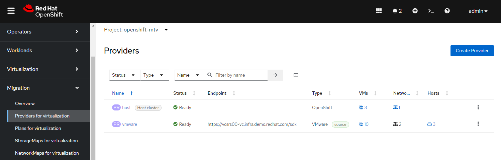</img> <br> 
   이 실습환경은 이미 `vmware`라는 **VMware Provider**로 구성되어 있으며 마이그레이션 소스로 표시되어 있습니다.


### 3.3 마이그레이션 계획 생성

이 계획에서는 VMware vSphere에서 레드햇 오픈시프트 가상화로 마이그레이션할 가상머신과 마이그레이션 실행 방법(콜드/웜, 네트워크 매핑, 스토리지 매핑, 사전/사후 후크 등)을 선택합니다.

1. 왼쪽 메뉴에서 **마이그레이션(Migration)** → **가상화 계획(Plans for virtualization)** 으로 이동한 후 **계획 생성(Create plan)** 을 누릅니다.

   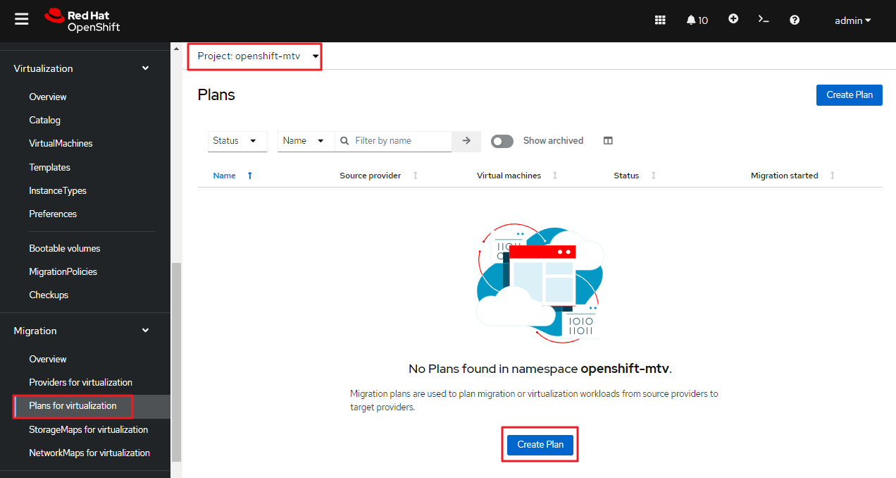</img> <br>
<br>

2. 마법사의 **1) Select source provider** 설정 단계에서 **VMware**를 선택합니다.

   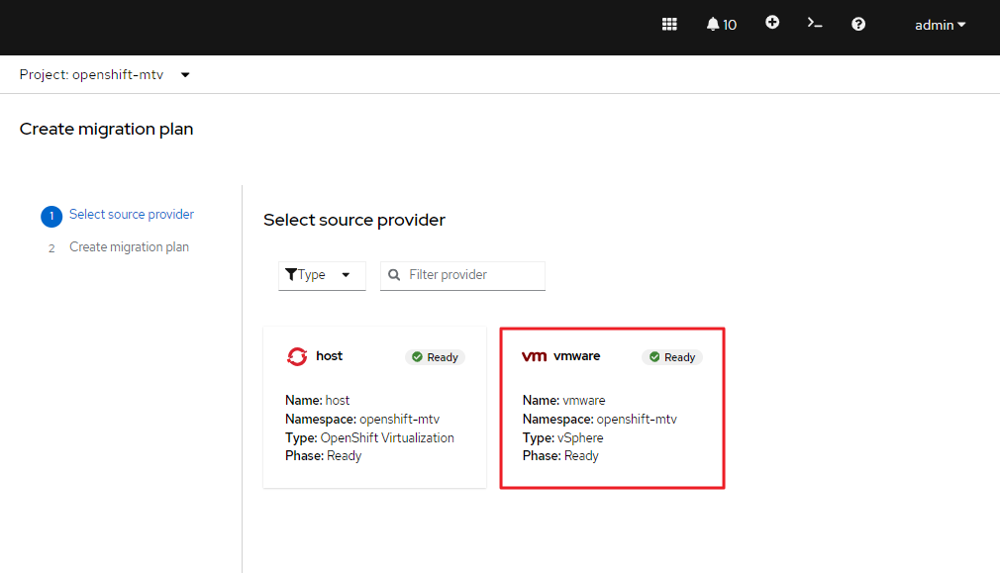</img> <br>

3. 다음 페이지에서 마이그레이션하려는 3개의 VM을 선택합니다.

  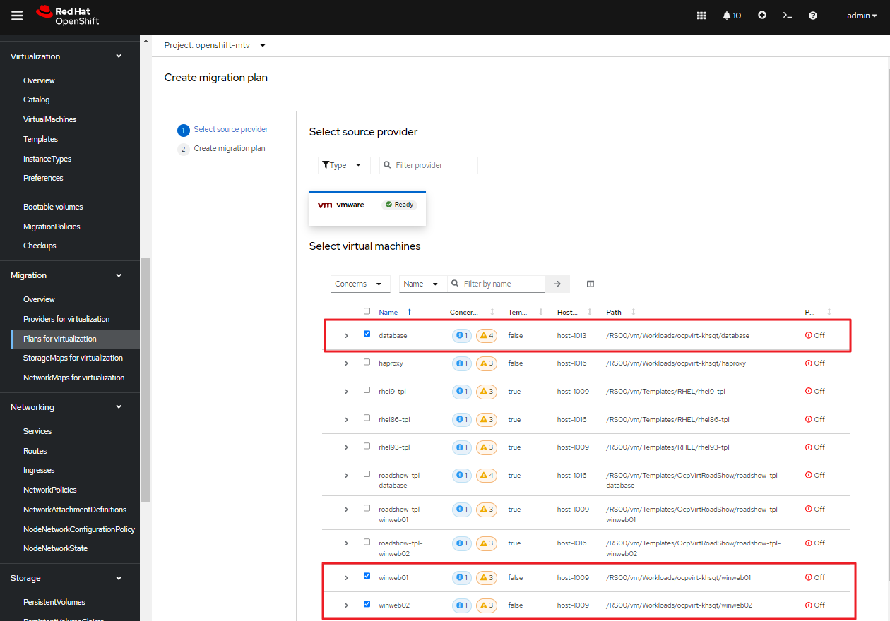</img> <br>

   * **database**
   * **winweb01**
   * **winweb02**
  
4. **Next**를 선택합니다.

5. 다음 화면에서는 마이그레이션 계획에 대한 세부 정보를 제공하는 작업을 수행하게 됩니다. 몇 가지 세부 정보가 이미 채워져있지만 VM이 올바른 네임스페이스에 배치되고 네트워크 및 스토리지 옵션이 올바르게 매핑되도록 몇 가지 사소한 수정을 수행해야 합니다.

   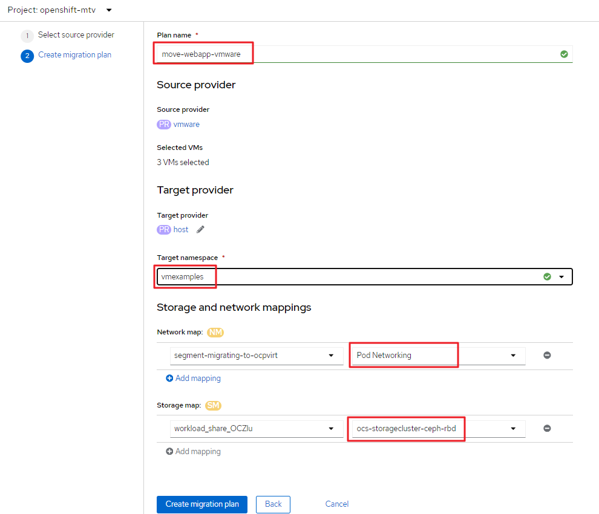</img> <br>

6. 다음 값으로 마이그레이션 계획을 작성하고, **Create migration plan**을 선택합니다.

   * **Plan name**: `move-webapp-vmware`
   * **Target namespace**: `vmexamples`
   * **Network map**: `Pod Networking`
   * **Storage map**: `ocs-storagecluster-ceph-rbd-virtualization`
   <br>
   Network 및 Storage Map 모두 검색된 가상 머신이 현재 Source Provider에서 사용하는 Network 및 Datastore를 자동으로 감지합니다.
   
<br>

7. 마이그레이션 계획이 준비되고 있음을 확인할 수 있는 새로운 화면으로 이동됩니다.

   </img> <br>
<br>

8. 잠시 후 계획이 준비된 상태가 됩니다. **Plan details** 아래에 녹색 **재생** 버튼을 클릭하여 마이그레이션 프로세스를 시작합니다.

   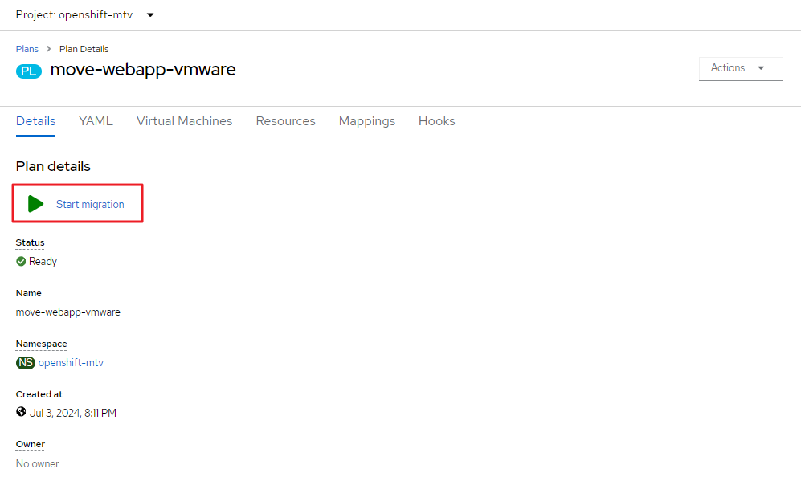</img> <br>
<br>

9. 마이그레이션을 시작하라는 확인 상자가 표시되면 **Start** 버튼을 클릭합니다.

   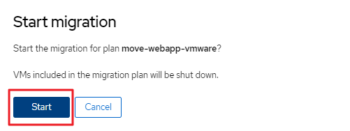</img> <br>
<br>

10. 마이그레이션 된 **3개의 VM 중 0개**라는 상태와 함께 진행률이 화면 중앙에 나타납니다.

   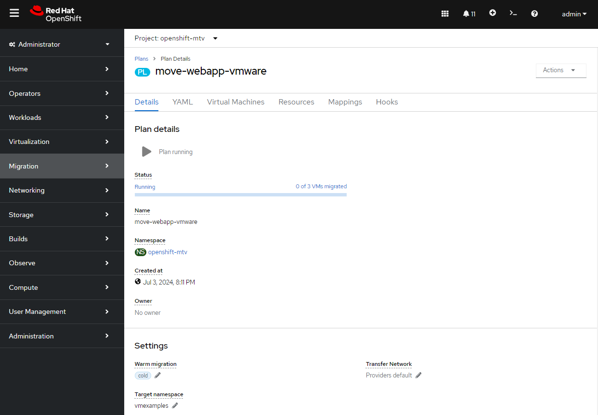</img> <br>
<br>

11. 마이그레이션이 진행되는 것을 확인합니다.

    진행 중인 마이그이션 (디스크 크기 및 네트워크에 따라 디스크를 복사하는 시간이 걸립니다)
    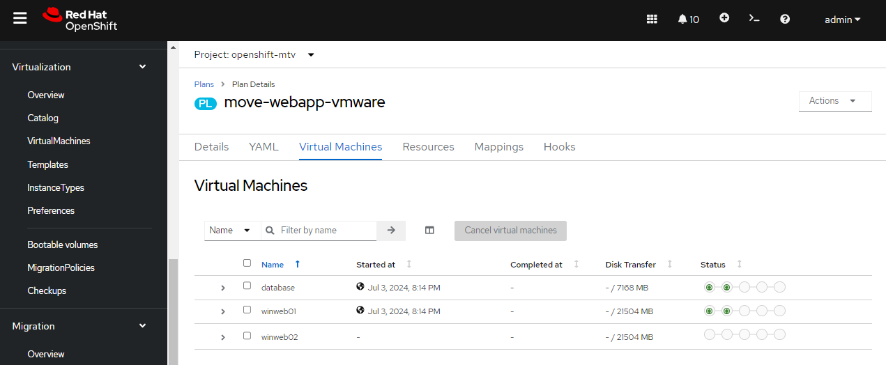</img> <br>

    시간이 지나면 마이그레이션이 완료됩니다.
    </img> <br>

> [!IMPORTANT]
> 많은 참가자가 동일한 작업을 병렬로 수행하면 이 작업이 실제 환경보다 느리게 수행될 수 있습니다. 기다려주십시오.
<br>

### 3.4 마이그레이션 가상머신 리뷰 및 구성

이제 가상머신이 마이그레이션되었으며 오픈시프트 가상화에서 시작할 수 있습니다. VMware vCenter에서와 마찬가지로 가상머신 콘솔에 연결하고 상호 작용할 수 있습니다.

그러나 가상머신은 아직 서로 연결되지 않았습니다. 이는 가상머신을 SDN에 연결했기 때문입니다. 이는 가상머신이 이전에 연결되었던 외부 네트워크와 약간 다르게 작동합니다.

오픈시프트의 로드밸런서를 **서비스(Service)** 라고 합니다. 로드밸런싱 서비스는 대상에 할당된 라벨을 통해 부하 분산하는 트래픽의 수신자를 선택합니다. 현재 가상머신에는 아직 라벨이 할당되지 않았습니다.

가상머신을 서비스와 성공적으로 연결하려면 다음을 수행해야 합니다.

* 가상머신에 라벨을 추가
  + 두 윈도우 IIS 서버 모두 동일한 로드밸런서 뒤에 있으므로 동일한 레이블을 사용
* 두 개의 윈도우 IIS 서버를 클러스터의 다른 작업에 사용할 수 있도록 서비스를 만듦
  + 오픈시프트는 서비스 이름을 DNS 이름으로 사용하여 내부적으로 로드밸런서에 자동으로 액세스
* **경로**를 생성하여 오픈시프트 외부에서 서비스를 사용

> [!NOTE]
> 가상머신이 정상적으로 마이그레이션 되었다면 `vmexamples` 프로젝트의 가상머신들을 대상으로 진행합니다. 가상머신을 마이그레이션 하지 않았다면 `vmimported` 프로젝트의 가상머신들을 대상으로 진행합니다.
<br>

1. 오픈시프트 콘솔에서 **Virtualization** → **VirtualMachines**로 이동하여 마이그레이션된 가상머신을 성공적으로 가져오고 실행 중인지 확인합니다.

   </img> <br>

> [!NOTE]
> `vmexamples` 프로젝트를 선택했는지 확인하세요.
<br>

2. `winweb01`에 액세스하고 **YAML** 탭으로 이동합니다.

   </img> <br>
<br>

3. `spec:` 섹션을 찾고 `template.metadata` 아래에 다음 줄을 추가하여 가상머신 리소스에 레이블을 지정합니다.

   ```yaml
         labels:
           env: webapp
   ```

   </img> <br>
   입력을 완료한 후 **저장**을 누릅니다.
   <br>

   </img> <br>
   변경된 것을 확인합니다.

> [!IMPORTANT]
> 위 스크린샷처럼 들여쓰기가 정확히 맞는지 확인하세요.
<br>

4. 가상머신 `winweb02`에 대해 프로세스를 반복합니다.

   </img> <br>
<br>

5. *가상 머신(Virtual Machines)* `database`, `winweb01` 및 `winweb02`를 시작합니다.

   </img> <br>

   각 가상머신의 콘솔 탭에 액세스하여 가상머신이 제대로 작동하는지 확인하세요.
   </img> <br>
<br>

6. **네트워킹** → **서비스** 로 이동하고 **서비스 만들기**를 누릅니다.

   </img> <br>

   가상머신에 추가한 레이블(`env=webapp`)을 기억하시나요? 여기서는 서비스가 선택기(selector)에서 해당 레이블을 사용하여 트래픽을 라우팅할 가상머신을 선택하는 것을 볼 수 있습니다.
   </img> <br>
<br>

7. YAML을 다음 정의로 바꿉니다.

   ```yaml
   apiVersion: v1
   kind: Service
   metadata:
     name: webapp
     namespace: vmexamples
   spec:
     selector:
       env: webapp
     ports:
       - protocol: TCP
         port: 80
         targetPort: 80
   ```
   </img> <br>
   * metadata.namespace의 값이 `vmexamples`인 것을 확인합니다.
<br>

8. **만들기**를 누르고 생성된 서비스를 확인합니다.

   </img> <br>
   
   **Pod 선택기**가 `env=webapp`인 것을 확인하고 이를 누릅니다.
   </img> <br>
   * 해당 서비스에 두 개의 winweb01/02 가상머신이 있는 것을 확인합니다.

   webweb01 관련 포드를 누릅니다.
   </img> <br>
   * **라벨**에 `env=winapp`가 있는 것을 확인합니다.
<br>

9. 이제 오픈시프트 클러스터 내에서 윈도우 IIS에 액세스할 수 있습니다. 다른 가상머신은 DNS 이름 `webapp.vmexamples`를 사용하여 여기에 액세스할 수 있습니다. 그러나 이러한 웹 서버는 외부에서 액세스 가능한 애플리케이션의 프런트 엔드이므로 **경로**를 사용하여 노출할 것입니다.

   왼쪽 탐색 메뉴에서 **네트워킹** → **경로**로 이동한 후 **경로 만들기**를 누릅니다.
   </img> <br>
<br>

10. 다음 정보를 입력하세요.

    </img> 
    * **이름**: `route-webapp`
    * **서비스**: `webapp`
    * **대상 포트**: `80 → 80 (TCP)`
    
    **만들기**를 누르세요
    <br>

> [!NOTE]
> 오픈시프트는 경로를 통해 클러스터에 들어오는 트래픽을 자동으로 (재)암호화할 수 있지만 이 애플리케이션에는 TLS를 사용할 필요가 없습니다. **`안전한 경로`** 옵션을 선택하면 안 됩니다.
<br>

11. 생성된 경로를 확인합니다.

    </img> <br>

    **위치** 필드에 표시된 주소로 이동합니다.
    </img> <br>
<br>

12. 페이지가 로드되면 오류가 표시됩니다. 이는 윈도우 웹 서버가 데이터베이스 가상머신에 연결하기 위해 내부 이름 `database`를 확인할 수 없기 때문입니다.

    연결 문제를 해결하려면 SDN에 연결된 다른 가상머신에서 검색할 수 있도록 데이터베이스 가상머신에 대한 또 다른 서비스를 생성해야 합니다. 이 데이터베이스는 오픈시프트 환경 외부에서 액세스할 필요가 없으므로 이 서비스에 대한 경로를 생성할 필요가 없습니다.

    **네트워킹** → **서비스**로 이동하여 **서비스 만들기**를 누르세요. YAML을 다음 정의로 바꿉니다.

    ```yaml
    apiVersion: v1
    kind: Service
    metadata:
      name: database
      namespace: vmexamples
    spec:
      selector:
        vm.kubevirt.io/name: database
      ports:
        - protocol: TCP
          port: 3306
          targetPort: 3306    
    ```
    </img> <br>
    YAML을 변경 완료 후 **만들기**를 누릅니다.
    <br>

    생성된 서비스를 확인합니다.
    </img> <br>

> [!NOTE]
> 이 예에서 서비스는 단순히 가상머신 이름 selector를 사용하고 있습니다. 모든 가상머신에 자동으로 추가되는 기본 레이블입니다. selector와 일치하는 가상머신이 하나만 있기 때문에 서비스는 데이터베이스에 대한 부하를 분산하지 않고 대신 내부 DNS 이름을 통한 검색을 위해 서비스를 사용합니다.
<br>

13. webapp URL을 다시 로드하면 적절한 결과를 얻을 수 있습니다.

    </img> <br>

    다시 로드하면 `visitor number`가 늘어 납니다.
    </img> <br>

> [!NOTE]
> 웹 서비스가 실행되는 데 시간일 걸릴 수 있습니다. 시간이 지나면 정상적으로 표시가 됩니다.
<br>
<br>

## 4. 요약

Migration Toolkit for Virtualization 외에도 세 가지 다른 마이그레이션 도구 키트가 있습니다. 이러한 조합을 사용하면 조직의 요구 사항에 따라 오픈시프트 클러스터 내에서 많은 워크로드를 이동할 수 있습니다.

* [Migration Toolkit for Runtimes](https://developers.redhat.com/products/mtr/overview) - 자바 애플리케이션 현대화 및 마이그레이션을 지원하고 가속화합니다.
* [Migration Toolkit for Applications](https://access.redhat.com/documentation/en-us/migration_toolkit_for_applications/) - 컨테이너 및 쿠버네티스에 대한 대규모 애플리케이션 현대화 노력을 가속화합니다.
* [Migration Toolkit for Containers](https://docs.openshift.com/container-platform/4.12/migration_toolkit_for_containers/about-mtc.html) - 오픈시프트 클러스터 간에 상태 저장 애플리케이션 워크로드를 마이그레이션합니다.

이에 대한 자세한 내용은 레드햇 고객 담당 팀에 문의하세요.

이 모듈에서는 VMware vSphere에서 레드햇 오픈시프트 가상화로 가상머신을 마이그레이션하는 방법을 살펴보았습니다. 두 개의 윈도우 시스템과 하나의 리눅스 시스템을 포함하는 웹 애플리케이션을 마이그레이션했습니다. 오픈시프트 기능을 사용하여 애플리케이션에 대한 네트워킹 액세스를 제공했으며, 프로젝트 내부 액세스를 제공하는 서비스를 생성하는 방법을 배웠습니다.
<br>
<br>

------
[차례](../README.md) &nbsp;&nbsp;&nbsp;&nbsp; [<< 스토리지 관리 <<](./storage_management.md) &nbsp;&nbsp;&nbsp;&nbsp; [>> 가상머신 로드밸런싱 >>](./vm_load_balancing.md)
